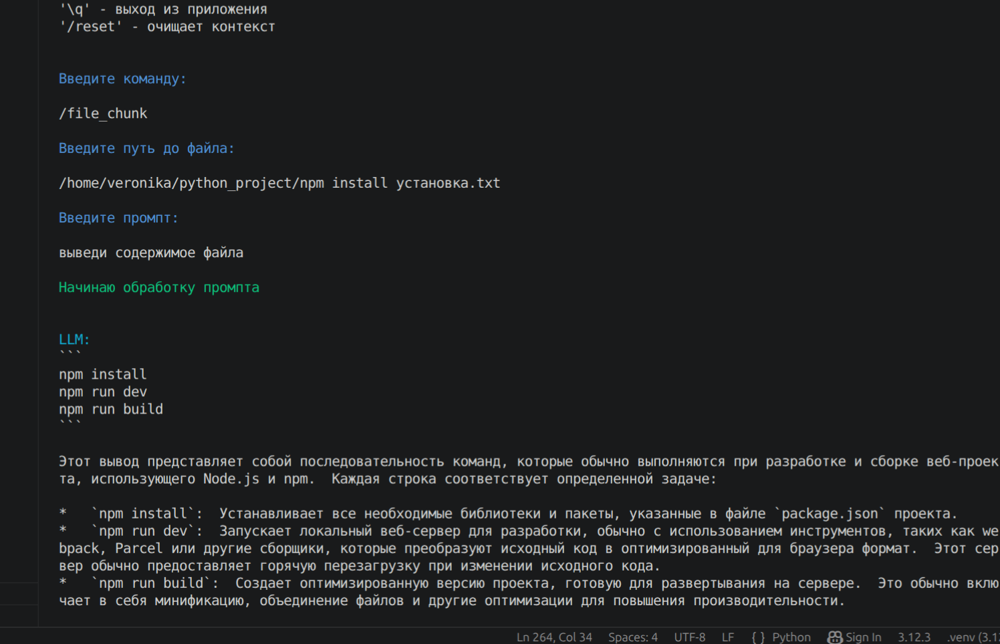
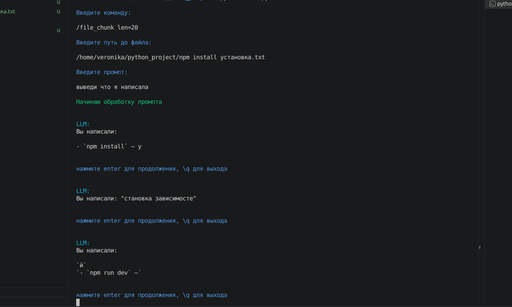
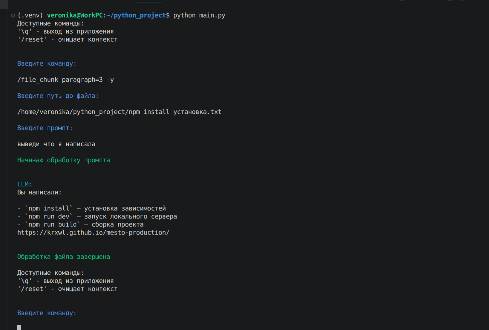

# Консольный клиент для общения с ИИ

Консольное приложение для взаимодействия с языковыми моделями через API

## Инструкция по запуску

1. Убедитесь, что у вас установлен Python 3.8+. Установите необходимые библиотеки:
   '''
   pip install openai pyyaml
   pip install python-dotenv # библиотека для подгрузки env переменных
   '''
2. Настройка конфигурации: Создайте файл config.yaml в корне проекта или задайте переменные окружения (API_KEY, API_HOST, LIMIT_CHARS, LIMIT_MESSAGE, TEMPERATURE). Пример config.yaml:

api_key: "ваш_токен"
api_host: "http://localhost:11434/v1/"
model: "имя_модели"
temperature: 0.7
limit_message: 20
limit_chars: 4000
system_prompt: "Ты полезный ИИ-ассистент."

3. Запуск. выполните команду в терминале

python -m src.main (убедитесь что вы находитесь в папке final_project!!!)

## Структура проекта

Проект разбит на 4 независимых модуля:

1. settings.py содержит:
Класс Colors: содержит коды для вывода цветного текста в консоль.

Константы сообщений: Тексты ошибок, приветствия, системные роли, максимальный размер файла

2. utils.py (Вспомогательные утилиты)

clear_screen(): очистка терминала

print_colored(): функция для удобного вывода цветного текста

get_file_content(): чтение файла

3. main.py
cодержит главный класс клиента AIAgent имеющий следующие методы

__init__(): настраивает клиента и загружает конфиги.

load_config() и get_yaml_configuration(): собирают итоговые настройки, отдавая приоритет переменным окружения над файлом YAML

follow_context_limits(): обрезает старые сообщения, если превышены лимиты по символам или количеству сообщений

process_inline_files(): ищет в тексте пользователя паттерны @::filepath:: и заменяет их содержимым указанных файлов

get_llm_response(): отправляет запрос к LLM

chunk_mode() и execute_chunk_processing(): читают файл и по частям отправляют его модели согласно заданному промпту.

run(): бесконечный цикл приложения